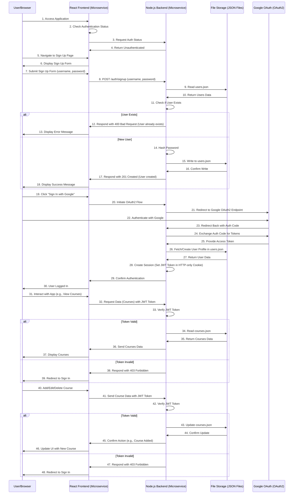
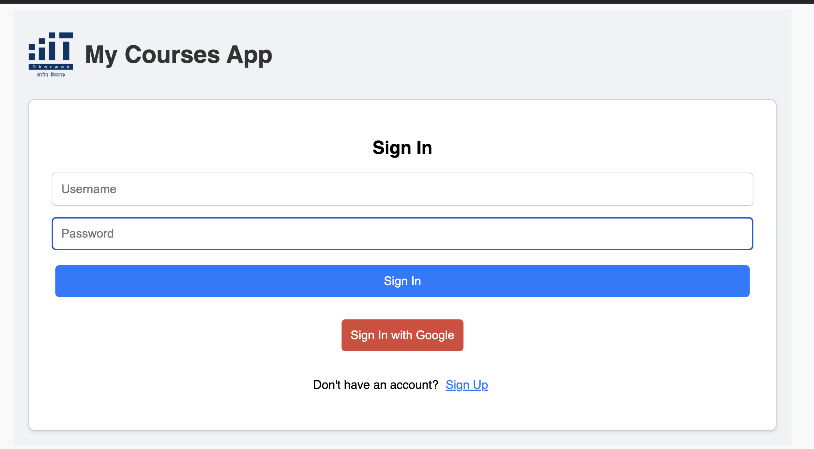
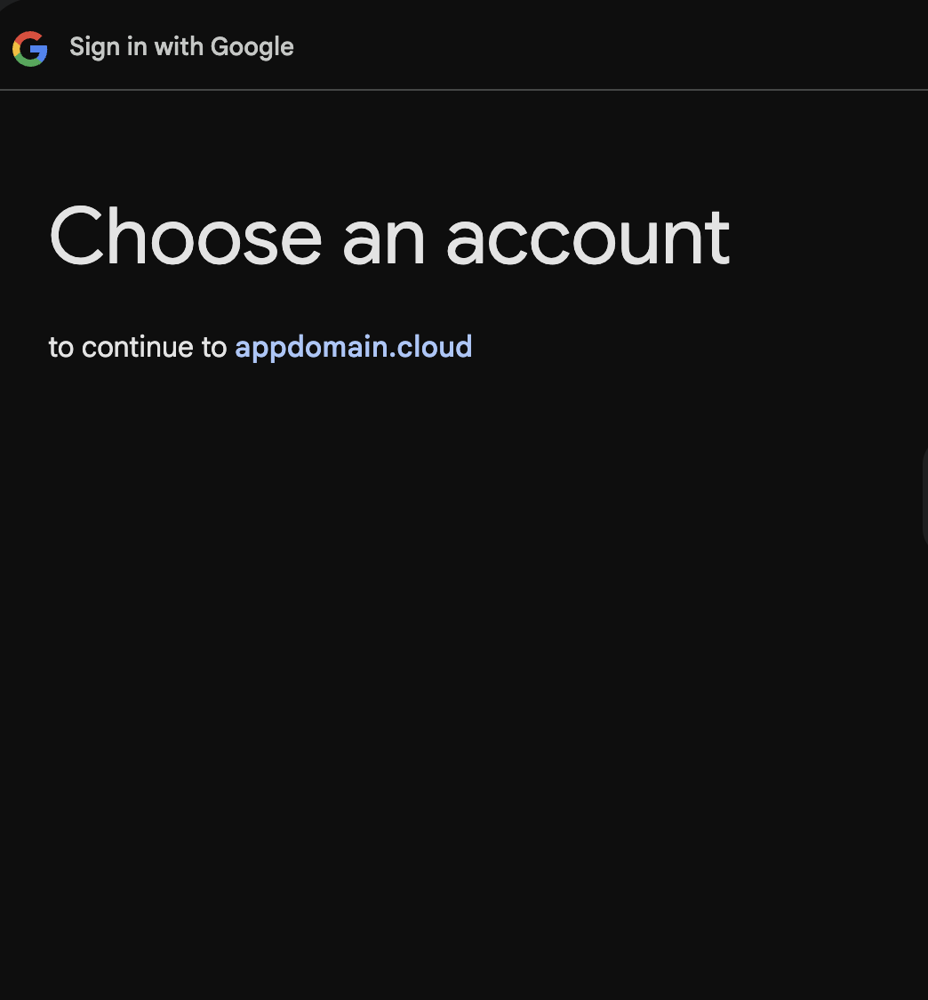

# MyCourses App

Welcome!

This repository contains the **MyCourses App**, a web application built using a **microservices architecture** with the **NodeJS, ReactJS and ExpressJS** (in this application, we're not using a database). Instead of MongoDB, we store data in JSON files on the server (shared data). The app allows users to manage courses, enrollments, and view team member information. It features user authentication using **OAuth2** (including Google OAuth), course management, and a user-friendly interface.

---

## Table of Contents

- [Overview](#overview)
- [Features](#features)
- [Architecture and Sequence Diagram](#architecture)
- [Prerequisites](#prerequisites)
- [Setup Instructions](#setup-instructions)
- [Environment Variables](#environment-variables)
- [Running the Application](#running-the-application)
- [Usage](#usage)
- [Deployment on IBM Cloud](#deployment-on-ibm-cloud)
- [Screenshots](#screenshots)
- [Testing Apis - Postman](#testing-apis---postman)
- [Live Demo 🌐](#live-demo-)
- [Testing Apis](#testing-apis)
- [Authors](#authors)
- [Notes](#notes)

---

## Overview

The **MyCourses App** is designed to help users manage course information effectively, mainly demonstrating CRUD Operations through authenticated APIs. It provides functionalities for:

- User authentication and authorization using **OAuth2**.
- Adding, editing, and deleting courses.
- Viewing a catalog of available courses.
- Enrolling in courses.
- Viewing enrolled courses.
- Displaying team member information.

---

## Features

### User Authentication:

- Sign up with username and password.
- Sign in with username/password or **Google OAuth2**.
- Password validation for security.
- Secure session management using **JWT tokens**.

### Course Management:

- Add new courses with details like title, description, semester, and enrollment status.
- Edit existing courses.
- Delete courses.
- View a catalog of all courses.
- Enroll or unenroll from courses.
- View a list of enrolled courses.

### Team Information:

- View profiles of team members.
- Access LinkedIn profiles.

### Responsive UI:

- User-friendly interface built with React.
- Responsive design for various screen sizes.
- Created a simple UI.

---

## Architecture and Sequence Diagram

- The application follows a **microservices architecture**, separating concerns between the frontend and backend services.
- Below is the sequence diagram of this application.



### Architecture Components:
- User/Browser (U): The end-user accessing the application.
- React Frontend (R): The client-side application built with React acting as a microservice.
- Node.js Backend (N): The server-side application handling API requests, acting as a microservice.
- File Storage (F): Data is stored in JSON files (users.json, courses.json) on the server.
- Google OAuth (G): Third-party authentication service using OAuth2 protocol.

---

## Prerequisites

Ensure you have the following installed:

- Node.js (v12 or later)
- npm (Node Package Manager)
- Docker and Docker Compose (optional, for containerized deployment)

---

## Setup Instructions
1. Clone the Repository

```bash
git clone https://github.com/KarthikAvinash/Group6Finalproject-cloud.git
cd Group6Finalproject-cloud
```

2. Install Dependencies
- Navigate to both the frontend and backend directories and install the required packages:

```bash
# In the frontend directory
cd frontend
npm install
```

```bash
# In the backend directory
cd ../backend
npm install
```

---

## Environment Variables

Create a .env file in the backend directory with the following variables:

```bash
PORT=5000
CLIENT_URL=http://localhost:3000
JWT_SECRET=your_jwt_secret
SESSION_SECRET=your_session_secret
GOOGLE_CLIENT_ID=your_google_client_id
GOOGLE_CLIENT_SECRET=your_google_client_secret
```

- Replace your_jwt_secret and your_session_secret with secure secret keys.
- Replace your_google_client_id and your_google_client_secret with your Google OAuth credentials from Google Cloud Console.

Create a .env file in the frontend directory with the following variable:

```bash
REACT_APP_API_URL=http://localhost:5000
```

---

## Running the Application

1. Start the Backend Server
In the backend directory:

```bash
npm start
```

The backend server (microservice) will run on http://localhost:5000.

2. Start the Frontend Application
In the frontend directory:

```bash
npm start
```
The frontend application (microservice) will run on http://localhost:3000

---

## Usage
### Access the Application:
- Open your browser and navigate to http://localhost:3000.

### Sign Up:
- Click on "Sign Up" to create a new account.
- Fill in the username and password fields.
- Password must be at least 8 characters, include at least one uppercase letter and one number.

### Sign In:
- Use your credentials to sign in.
- Or click "Sign In with Google" to authenticate via Google OAuth2.

### Course Catalogue:
- View all available courses.
- Add a new course by filling in the course details.
- Edit or delete existing courses.
- Enroll or unenroll from courses.

### My Courses:
- View courses you are enrolled in.

### Our Team:
- View team member profiles.
- Access LinkedIn profiles by clicking on the LinkedIn icon.

---
## Deployment on IBM Cloud

The application is deployed on **IBM Cloud** using **IBM Code Engine**. Below are the steps taken to push the code:

### 1. Build and Push Docker Images to Docker Hub

**Frontend:**

```bash
# Navigate to the frontend directory
cd frontend

# Build the Docker image
docker build -t karthikavinash01/frontend:latest .

# Push the image to Docker Hub
docker push karthikavinash01/frontend:latest
```

**Backend:**
```bash
# Navigate to the backend directory
cd ../backend

# Build the Docker image
docker build -t karthikavinash01/backend:latest .

# Push the image to Docker Hub
docker push karthikavinash01/backend:latest
```

### 2. Set Up IBM Cloud Environment
Access IBM Cloud Shell: Go to the IBM Cloud Shell.

- Install Container Registry Plugin:

```bash
ibmcloud plugin install container-registry -r 'IBM Cloud'
```

- Log In to IBM Cloud:

```bash
ibmcloud login -a https://cloud.ibm.com
```

- Configure IBM Cloud Container Registry:

```bash
ibmcloud cr region-set us-south
ibmcloud cr namespace-add ibm_cloud_project
ibmcloud cr login
```

### 3. Push Docker Images to IBM Cloud Container Registry
```bash
# Pull images from Docker Hub
docker pull karthikavinash01/frontend
docker pull karthikavinash01/backend

# Tag images for IBM Cloud Container Registry
docker tag karthikavinash01/frontend us.icr.io/ibm_cloud_project/frontend:latest
docker tag karthikavinash01/backend us.icr.io/ibm_cloud_project/backend:latest

# Push images to IBM Cloud Container Registry
docker push us.icr.io/ibm_cloud_project/frontend:latest
docker push us.icr.io/ibm_cloud_project/backend:latest
```

### 4. Verify Images in IBM Cloud Registry
```bash
ibmcloud cr image-list
```

### 5. Deploy on IBM Code Engine
- Create Code Engine Project: If not already created, set up a new project in IBM Code Engine.

- Deploy Backend Service:
  - Use the IBM Cloud Console or CLI to create a new application.
  - Specify the image URL: us.icr.io/ibm_cloud_project/backend:latest.
  - Set environment variables and configurations as needed.

- Deploy Frontend Service:
  - Create another application for the frontend.
  - Specify the image URL: us.icr.io/ibm_cloud_project/frontend:latest.
  - Ensure the frontend can communicate with the backend service.

These steps were taken to containerize the application and deploy it on IBM Cloud using IBM Code Engine.

---

## ScreenShots

### Authentication


### OAuth


### Get All Courses


### Add Course


### Update Course


### Delete Course


---

## Live Demo 🌐
Experience the live application hosted on IBM Cloud:
👉 [App Hosted on Cloud Using IBM Code Engine](https://group6frontend.1o809c3feyfk.us-south.codeengine.appdomain.cloud/)

--- 
## Testing Apis - Postman
- Below are the code snippets and corresponding **Postman** outputs for the APIs related to course management. 
- These APIs have been **tested** using Postman. All APIs require an **Auth Token** for authentication.

### GET /courses 
- Get all the courses available
<table> <tr> <td></td> <td></td> </tr> </table>


### POST /course 
<table> <tr> <td></td> <td></td> </tr> </table>

### GET /course/id 
- Get details of a course 
<table> <tr> <td></td> <td></td> </tr> </table>

### UPDATE /course/id
- Update details of the course
<table> <tr> <td></td> <td></td> </tr> </table>

### DELETE /course/id
- Delete a course by id
<table> <tr> <td></td> <td></td> </tr> </table>

---

## Authors
- Chaturth R *(21bcs025)*
- Ekansh Thakur *(21bcs037)*
- Jaishana Bindu Priya *(21bcs045)*
- Karthik Avinash *(21bcs052)*
- Tejas S *(21bcs125)*

--- 
## Notes

- **Data Storage:** The application uses JSON files (`users.json`, `courses.json`) to store user and course data instead of a database. This approach simplifies deployment and testing but is not recommended for production environments due to scalability and security considerations.

- **Microservices Architecture:** The app follows a microservices architecture, consisting of multiple services that work together to provide the full functionality of the application. The microservices used are:

  - **Frontend Microservice:** A React application that handles the user interface and client-side logic. It communicates with the backend via RESTful API calls.
  
  - **Backend Microservice:** A Node.js and Express server that handles API requests, business logic, and data processing. It reads from and writes to JSON files for data persistence.
  
  - **Authentication Microservice:** Integrated within the backend, this service manages user authentication and authorization. It supports local authentication (username and password) and third-party authentication using **OAuth2** with Google.
  
  - **Google OAuth Microservice:** External service provided by Google, used for secure authentication via Google accounts.
  
  - **Session Management Microservice:** Manages user sessions using JWT tokens stored in HTTP-only cookies for security.

  By separating these concerns into distinct services, the application achieves better scalability, maintainability, and the ability to develop and deploy services independently.

- **OAuth2 Authentication:** User authentication is handled using the **OAuth2** protocol, providing secure and reliable authentication flows. The application supports both local authentication and Google OAuth2 for third-party authentication. This enhances security and provides users with flexible sign-in options.

- **Sequence Diagram Updates:** The sequence diagram has been updated to reflect the use of file storage rather than a database and the **OAuth2** authentication flow. It accurately represents the interactions between all microservices and components in the application.

- **Backend Microservice:** The backend reads from and writes to JSON files to handle data persistence and manages authentication using JWT tokens. It exposes RESTful API endpoints for:

  - **Authentication Routes:** Sign up, sign in, sign out, and Google OAuth callbacks.
  - **Course Management Routes:** CRUD operations for courses.
  - **User Session Management:** Verifying authentication status and handling session tokens.

- **Frontend Microservice:** The frontend interacts with the backend via API calls to manage authentication and course data. It handles:

  - **Routing and State Management:** Manages different views such as sign-in, sign-up, course catalog, enrolled courses, and team information.
  - **User Interface Components:** Responsive design components for forms, buttons, cards, and navigation tabs.
  - **Stateful Components:** Uses React hooks to manage component state and side effects.

- **External Services:**
  
  - **Google OAuth2 Service:** Utilized for secure user authentication via Google accounts.
  - **LinkedIn Profiles:** Team member profiles link to their respective LinkedIn pages.

- **Security Considerations:**

  - **JWT Tokens:** Used for session management, stored in HTTP-only cookies to prevent XSS attacks.
  - **Password Validation:** Enforces strong password policies during sign-up.
  - **CORS Configuration:** Backend configured to accept requests only from the specified client URL.

---
